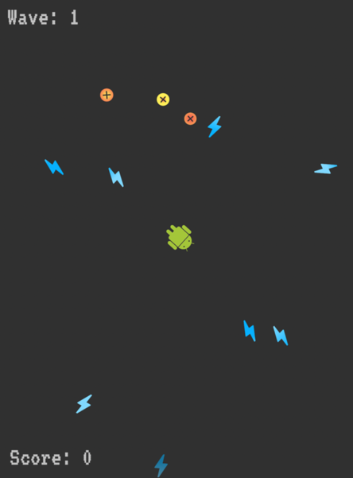

# flutter_counter_shooter

A typical "flutter counter demo" project with shoot capability

Some ~~interesting~~ details:
- Firebase is used for hosting and for high score storage
- Hand-written game engine uses Widgets instead of canvas painter

[Playable web demo](https://flutter-counter-demo-9209c.web.app/#/)

